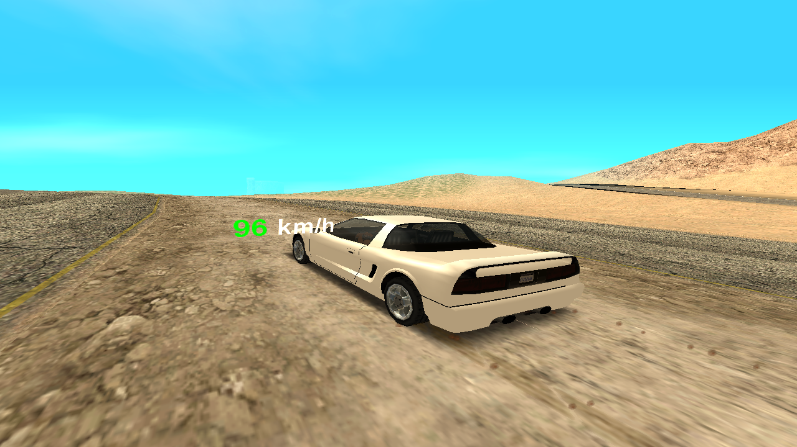
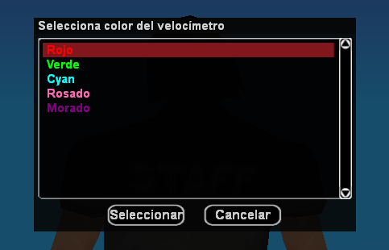
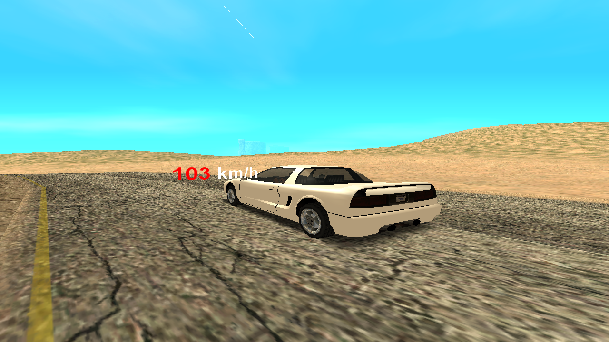
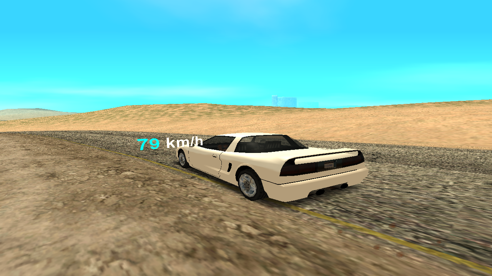
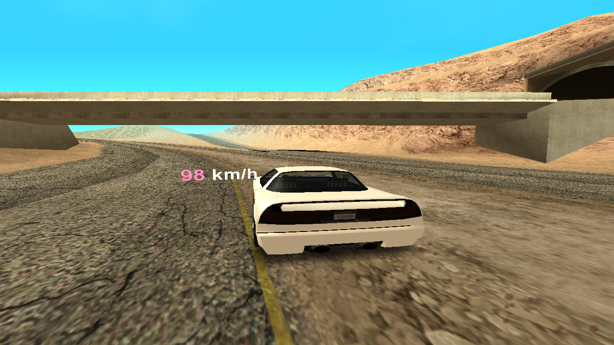
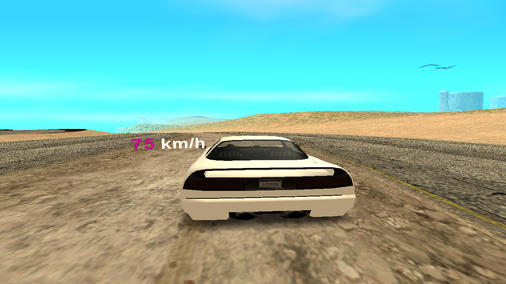

<h1 align="center">3D Speedometer + Color Menu</h1>

    

**Este Velocimetro incluye funciones para personalizarlo dentro del servidor. Al usar el comando `/speedcolor` se abre el menú de personalización donde los jugadores pueden elegir los colores disponibles. Permitiendo a los jugadores ajustar el color del velocimetro a su gusto. Garantizando una experiencia estable y personalizada en el servidor.**

## 🎨 Colores (Velocimetro) [Imagenes - Pictures]

**Explicación: El Velocimetro modificado a los colores de la lista disponible**  

---

**Velocimetro - Color Original (Verde)**

---

**Velocimetro - Color Rojo**

---

**Velocimetro - Color Cyan**

---

**Velocimetro - Color Rosa**

---

**Velocimetro - Color Morado**

## _Comando_

  `/speedo` - Activa/Desactiva el Velocimetro!  
  `/speedcolor` - Menu de Colores disponibles para el Velocimetro!  
  
## Aclaración

**Puede modificar o ajustar cualquier parte del sistema si lo necesita, añadir más colores, ampliar las funciones. También puede corregir textos, mejorar las funciones o agregar detalles que crea útiles. Así podrá adaptarlo mejor a su proyecto o a la forma en que prefiera que funcione el sistema.**

## Creditos

- Desarrollador **(Straydet)** -> *(Funciones añadidas, mejoras y demás)*
- [Idea y versión original](https://github.com/AceAbhishekOfficial/3DSpeedo) - **(Ace Abhishek)**
